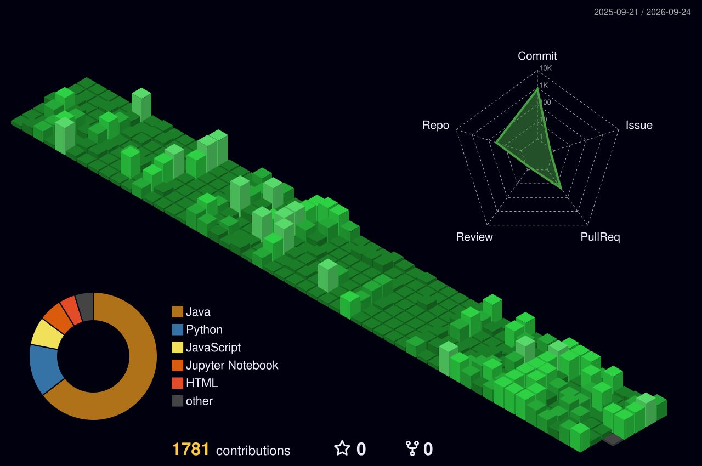

  

# 👋 Hi, I'm SUDARSHAN!
<!--If anyone trys to copy this code it will turn out to be very bad for you-->
### 👩‍💼 **Myself :** 
A.I.M.L Enthusiast sharing about my journey and learnings in Tech.  
<!--SPRX77-->
### 👩🏻‍💻 **Education :** 
Studing Computer Engineering in Artificial-Intelligence at D.K.T.E. Textile & Engineering College , Ichalkaranji.  
<!--SPRX77-->
### 🧠 **About Me :** 
Curious to learn new tech and do project.  
<!--SPRX77-->
### 👫 **Project Partner :** 
I work with [SAKSHI BIRANJE](https://github.com/SakshiBiranje) on various project and studies.  
<!--SPRX77-->
### 🗣️ **Ask Me About :** 
C, C++, JAVA, Python, OOP, DSA, Web Development(Frontend).   
<!--SPRX77-->

  

# 💻 Tech Stack

  

### **CODING LANGUAGES**
&nbsp;
&nbsp;
&nbsp;
&nbsp;
&nbsp;
&nbsp;
&nbsp;
&nbsp;
&nbsp;
&nbsp;
&nbsp;
&nbsp;

### **DATABASE**
&nbsp;
&nbsp;

### **DEVOPS AND CLOUD**
&nbsp;
&nbsp;
&nbsp;
&nbsp;

### **LIBRARIES AND FRAMEWORKS**
&nbsp;
&nbsp;
&nbsp;
&nbsp;
&nbsp;
&nbsp;
&nbsp;
&nbsp;
&nbsp;
&nbsp;
&nbsp;
&nbsp;
&nbsp;
&nbsp;
&nbsp;
&nbsp;
&nbsp;
&nbsp;
&nbsp;
&nbsp;
&nbsp;
&nbsp;

### **TOOLS AND IDE**
&nbsp;
&nbsp;
&nbsp;
&nbsp;
&nbsp;
&nbsp;
&nbsp;
&nbsp;
&nbsp;
&nbsp;
&nbsp;
&nbsp;
&nbsp;
&nbsp;

  

## 🌐 My References 
&nbsp;
&nbsp;
&nbsp;

  

## 💡 My Development Workflow

  

  <table>
    <tr>
      <td width="20%" align="center">
         
        <b>1. Plan</b>
      </td>
      <td width="20%" align="center">
         
        <b>2. Version Control</b>
      </td>
      <td width="20%" align="center">
         
        <b>3. Environment Setup</b>
      </td>
      <td width="20%" align="center">
         
        <b>4. Code</b>
      </td>
      <td width="20%" align="center">
         
        <b>5. Test</b>
      </td>
    </tr>
    <tr>
      <td width="20%" align="center">
         
        <b>6. Commit & Push</b>
      </td>
      <td width="20%" align="center">
         
        <b>7. Continuous Integration</b>
      </td>
      <td width="20%" align="center">
         
        <b>8. Code Review</b>
      </td>
      <td width="20%" align="center">
         
        <b>9. Deploy</b>
      </td>
      <td width="20%" align="center">
         
        <b>10. Monitor</b>
      </td>
    </tr>
  </table>

  

# 📊 GitHub Stats:
  

  

  

  

  

# 🦾 Leetcode:

    

  
  

  

  

## 🤝 Connect With Me

  

  
  
  
  

  
  
  
  

  

  

  

  <h3>Thanks for visiting my profile! Let's connect and build something amazing together. 🚀</h3>

